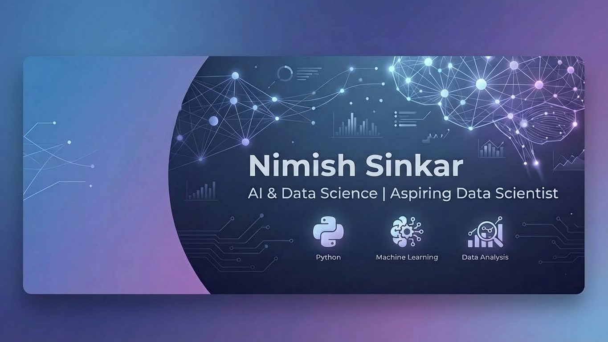

  

# 👋 Hi, I'm Nimish Pravin Sinkar

### 🎓 AI & Data Science Student | 🐍 Python Enthusiast | 📊 Aspiring Data Scientist

  <i>"Turning raw data into actionable insights."</i>

 

---

### 👨‍💻 About Me

- 🎓 I am a **3rd-year B.E. student** in **Artificial Intelligence & Data Science** at **PVGCOE, Nashik**.
- 🔭 I’m currently working on enhancing my **Machine Learning** and **Data Visualization** skills.
- 💼 **Seeking internship opportunities** in Data Science, ML, or Data Analytics.
- 👯 I’m looking to collaborate on open-source Python or Data Science projects.

---

### 🛠️ Tech Stack & Tools

| **Category** | **Technologies** |
|:---:|:---|
| **Languages** |   |
| **Data Science** |      |
| **Web Dev** |  |
| **Tools** |    |

---

### 📂 Featured Projects

#### 📊 [Student Performance Classification](https://github.com/nimish-23/student-performance-classification)
> *Using Machine Learning to analyze academic trends.*
>
> A multi-class classification project that predicts student performance levels (Low, Medium, High).
> - **Tech:** Python, Scikit-Learn, Pandas, Seaborn.
> - **Key Features:** Extensive EDA, Feature Engineering, and Model evaluation using Logistic Regression & Random Forest.

#### 🗂️ Academic Result Management System *(In Progress)*
> *Streamlining result management for educational institutions.*
>
> A Django-based web application designed to manage student results, course data, and administrative access.
> - **Tech:** Django, SQLite, HTML/CSS.

---

### 📈 GitHub Stats

<table>
  <tr>
    <td align="center">
      
    </td>
    <td align="center">
      
    </td>
  </tr>
</table>

---

  
Thanks for visiting my profile! Feel free to check out my repositories.

